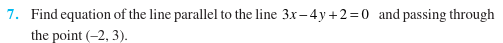
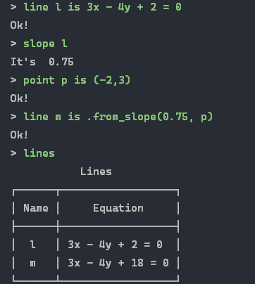

## Why?

## Does it break?
**Yes. If you want it to.**

## Is it always useful?
**No. Sometimes.**

## What can it do?
- create lines from slope, intercepts. two points or equation
- find distances between points or lines
- find perpendicular lines and angle between lines
- *and perhaps more in the future*

## Is it easy to use?
**Mostly, yes.**